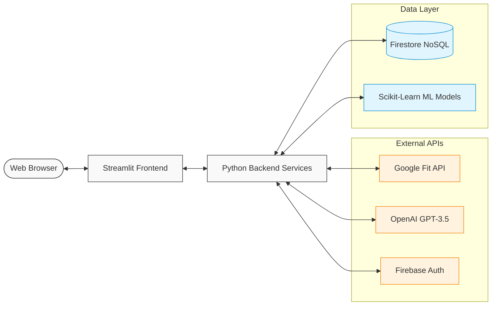
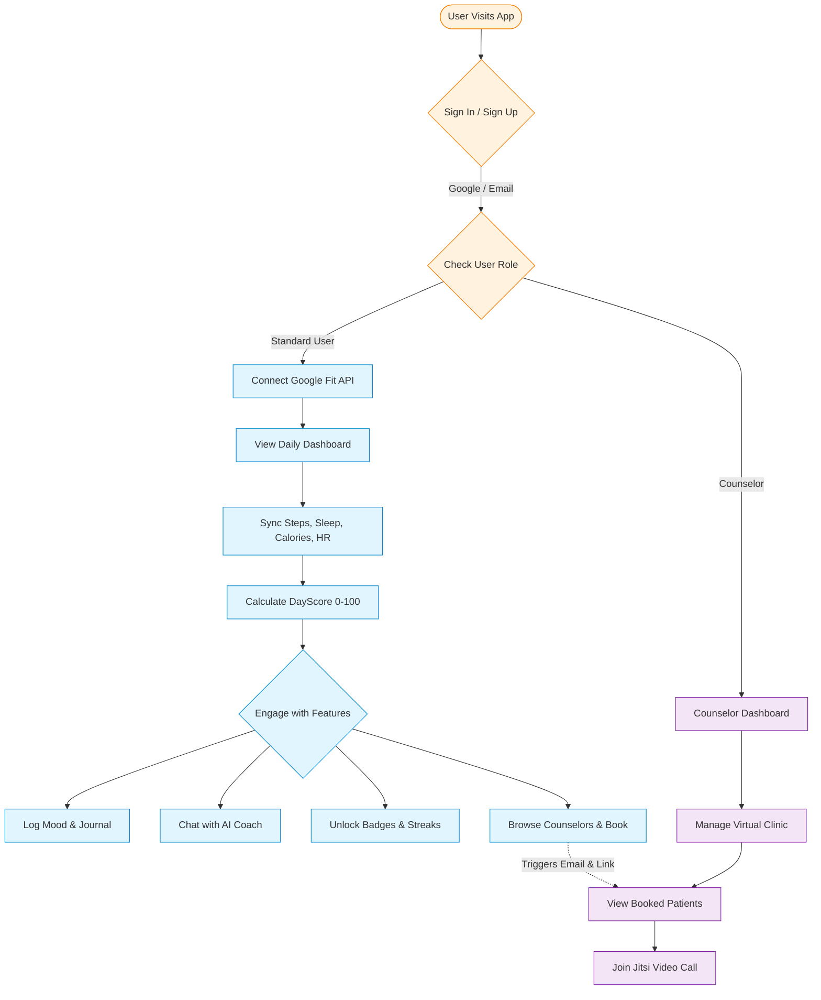

<div align="center">
  
  
  
  
  
  
  <h1>💙 DayScore — Smart Wellness Tracking App</h1>
  <p>A modern, production-ready wellness web application that connects to Google Fit, calculates a daily health score (0–100), provides AI-powered insights, mood journaling, mental health tracking, counselor booking, community challenges, and gamification to encourage healthy habits.</p>
</div>

---

## 📑 Table of Contents

- [✨ Key Features](#-key-features)
- [🏗️ System Architecture](#️-system-architecture)
- [🛠️ Tech Stack](#️-tech-stack)
- [🔄 Complete User Flow](#-complete-user-flow)
- [🗄️ Database Structure](#️-database-structure-firestore)
- [🧠 DayScore Calculation Algorithm](#-dayscore-calculation-algorithm)
- [🚀 Complete Installation & Setup Guide](#-complete-installation--setup-guide)
- [🧪 Testing](#-testing)
- [🤝 Contributing & License](#-contributing--license)

---

## ✨ Key Features

* **📊 Dynamic Dashboard:** Circular DayScore gauge, real-time fitness metrics (steps, sleep, calories), and weekly trend charts.
* **🧠 AI Wellness Coach (Dr. Mira):** Multi-personality chatbot powered by OpenAI GPT-3.5-turbo (with intelligent fallback). Context-aware CBT (Cognitive Behavioral Therapy) responses.
* **👨‍⚕️ Counselor Directory & Booking:** Role-Based Access Control (RBAC) separating Patients and Counselors. Book sessions, auto-generate Jitsi video links, and receive SMTP email confirmations.
* **📝 Mental Health Tracker & Journal:** Mood journaling with sentiment analysis, emotion tagging, and weekly trend tracking.
* **🏆 Achievements & Community:** Unlockable badges, daily streaks, global leaderboards, and user-to-user messaging.
* **🔮 ML Predictions:** Next-day score predictions using scikit-learn Linear Regression models.

---

## 🛠️ Tech Stack

| Layer | Technology |
|---|---|
| **Frontend** | Streamlit, HTML5, Plotly, Custom CSS (Glassmorphism) |
| **Backend & DB** | Python, Firebase Admin SDK (Auth & Firestore NoSQL) |
| **Health Data** | Google Fit API (OAuth 2.0 with CSRF protection) |
| **AI / ML** | OpenAI API, scikit-learn, Pandas, NumPy |
| **Integrations** | `smtplib` (Emails), Jitsi (Video Calling), Python `uuid` |

---

## 🏗️ System Architecture



---

## 🔄 Complete User Flow

DayScore supports a comprehensive dual-role flow for standard users (patients) and counselors.

### User Journey Flowchart



### Step-by-Step Breakdown

1. **Authentication:** Users sign up or log in via **Email/Password** or **Google Sign-In**. Role detection determines if the user is a standard patient or a registered counselor.
2. **Onboarding & Health Sync:** Patients connect their **Google Fit** account. DayScore automatically pulls daily steps, sleep, calories, and heart rate data via the Google Fit API.
3. **Daily Tracking:** The dashboard calculates a personalized **DayScore (0-100)** based on the synced health data.
4. **Mental Health & Journaling:** Users can log their mood, emotions, and gratitude in the **Journal**. This data feeds into the mental health trend charts.
5. **AI Coaching & Gamification:** Users can chat with the AI Wellness Coach (powered by OpenAI) for personalized advice, and unlock badges/streaks based on consistent platform usage.
6. **Counselor Interaction:** Standard users can browse the Counselor Directory, book sessions, and receive an automated Jitsi video link via email. Counselors can log in to view their booked sessions and manage their virtual clinic.

---

## 🗄️ Database Structure (Firestore)

DayScore relies on Firebase Firestore (NoSQL) for scalable, real-time data storage. Key collections include:

| Collection | Key Fields / Purpose |
|---|---|
| `users` | `email`, `name`, `role`, `google_fit_credentials`, `streak`, `points` |
| `counselors` | `user_id` (refs `users`), `specialty`, `clinic_name`, `meeting_link` |
| `daily_scores` | `user_id`, `date`, `total_score`, `steps`, `sleep_hours`, `calories`, `heart_rate` |
| `journal_entries`| `user_id`, `date`, `mood_value`, `emotions`, `gratitude`, `text` |
| `chat_history` | `user_id`, `role`, `content`, `persona`, `timestamp` (AI conversations) |
| `counselor_bookings`| `user_id`, `counselor_id`, `date`, `time`, `status`, `meeting_link` |
| `achievements` | `user_id`, `badge_id`, `badge_name`, `unlocked_at` |
| `challenges` | `title`, `metric`, `target`, `start_date`, `end_date`, `participants` |
| `messages` | `sender_id`, `receiver_id`, `content`, `timestamp`, `read` |

---

## 🧠 DayScore Calculation Algorithm

The core proprietary algorithm calculates a holistic wellness score daily:

* **Steps (30% Weight):** Linear scale capping at 10,000 steps for maximum points.
* **Sleep (30% Weight):** Uses a bell-curve algorithm peaking at 7.5–8.0 hours. Too little or too much sleep reduces the score.
* **Calories (20% Weight):** Linear scale capping around a 2,000 kcal active burn goal.
* **Heart Rate (20% Weight):** Rewards a healthy resting heart rate zone (typically 60-70 BPM).

The weighted sum provides a unified score from 0–100, which is also used by our Machine Learning prediction service to forecast tomorrow's score based on the past 30 days of activity.

---

## 🚀 Complete Installation & Setup Guide

Follow these steps to run the DayScore project locally on your machine.

### 1. Prerequisites

* **Python 3.10+** (Python 3.12 recommended)
* **Git** installed on your system
* A **Google Cloud Console** account (for Google Fit API)
* A **Firebase Console** account (for Authentication and Firestore)

### 2. Clone the Repository

```bash
git clone https://github.com/yourusername/dayscore.git
cd dayscore
```

### 3. Create a Virtual Environment

It is highly recommended to use a virtual environment to isolate dependencies.

**For Windows:**

```bash
python -m venv .venv
.venv\Scripts\activate
```

**For macOS/Linux:**

```bash
python3 -m venv .venv
source .venv/bin/activate
```

### 4. Install Dependencies

```bash
pip install -r requirements.txt
```

### 5. Environment Variables Configuration

Copy the sample environment file to create your active configuration.

```bash
cp .env.example .env
```

Open the `.env` file and fill in the required keys.

---

## 🔧 External Service Configuration

### A. Firebase Setup (Auth & Database)

1. Go to the [Firebase Console](https://console.firebase.google.com/).
2. Create a new project (e.g., "DayScore").
3. Go to **Authentication** -> **Sign-in method** and enable **Email/Password**.
4. Go to **Firestore Database** and create a database (start in **Test Mode** for development).
5. Go to **Project Settings** (gear icon) -> **Service Accounts**.
6. Click **Generate new private key**. This will download a JSON file.
7. Rename this file to `serviceAccountKey.json` and move it into the `config/` folder of the project repository (`config/serviceAccountKey.json`).
8. Copy the remaining configuration details (API Key, Project ID, etc.) into your `.env` file.

### B. Google Fit API Setup

1. Go to the [Google Cloud Console](https://console.cloud.google.com/).
2. Create a new project.
3. Search for **Fitness API** in the API library and click **Enable**.
4. Go to **Credentials** -> **Create Credentials** -> **OAuth client ID**.
   * Application type: **Web application**.
   * Authorized redirect URIs: `http://localhost:8501`.
5. Copy the **Client ID** and **Client Secret** into your `.env` file.

### C. OpenAI & SMTP Setup (Optional)

* **OpenAI:** Add your `OPENAI_API_KEY` to the `.env` file to enable the AI Chatbot. (If left blank, the app will gracefully fallback to rule-based therapeutic responses).
* **SMTP (Email Notifications):** Add your Gmail/SMTP credentials to the `.env` file. *(Note: If using Gmail, you must generate an "App Password" from your Google Account security settings).*

---

## 🏃 Running the Application

Once your `.env` file and `serviceAccountKey.json` are set up, run the application:

```bash
streamlit run app.py
```

The application will launch in your default web browser at `http://localhost:8501`.

> **💡 Demo Mode:** If you do not want to configure the API keys immediately, simply run the app and click **"Try Demo Mode"** on the login screen to explore the UI using simulated backend data!

---

## 👨‍⚕️ Administrator Actions

### How to Auto-Register Counselors

If you want to bypass the UI and batch-register medical professionals (Counselors, Therapists, Dietitians), we have included an automated script.

This script will:

1. Parse an array of emails and extract their specialties.
2. Create Firebase Authentication accounts for them.
3. Save their professional details to Firestore.
4. Generate a permanent Jitsi Video Call link for their virtual clinic.
5. Send an automated email with their login credentials and meeting link.

**To run the script:**

```bash
python register_script.py
```

---

## 📝 Project Structure Highlights

* `app.py`: Main entry point containing the UI logic and Streamlit routing.
* `services/`: Contains the core backend logic (e.g., `scoring_service.py`, `counselor_service.py`, `google_fit_service.py`).
* `auth/`: Manages Firebase Identity toolkit and Google OAuth workflows.
* `features/`: Individual dashboard pages (Journal, Achievements, Settings).
* `config/`: Centralized settings and Firebase Admin SDK initializations.

---

## 🧪 Testing

DayScore uses `pytest` for unit testing the core services (scoring, algorithms, and business logic).
To run the test suite:

```bash
pytest tests/ -v
```

---

## 🤝 Contributing & License

1. **Fork** the repository and create your feature branch (`git checkout -b feature/AmazingFeature`).
2. **Commit** your changes (`git commit -m 'Add some AmazingFeature'`).
3. **Push** to the branch (`git push origin feature/AmazingFeature`).
4. **Open a Pull Request**.

This project is licensed under the **MIT License**. See the `LICENSE` file for more details.

---

<div align="center">
  <b>Built with ❤️ by DayScore Team</b><br>
  <i>💙 Track • 📊 Score • 🧠 Reflect • 🏆 Achieve • 🧘 Relax</i>
</div>
